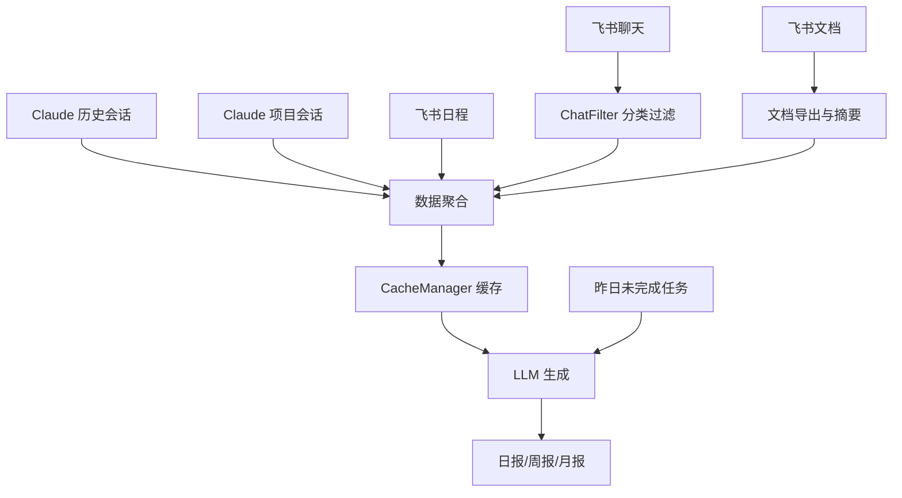
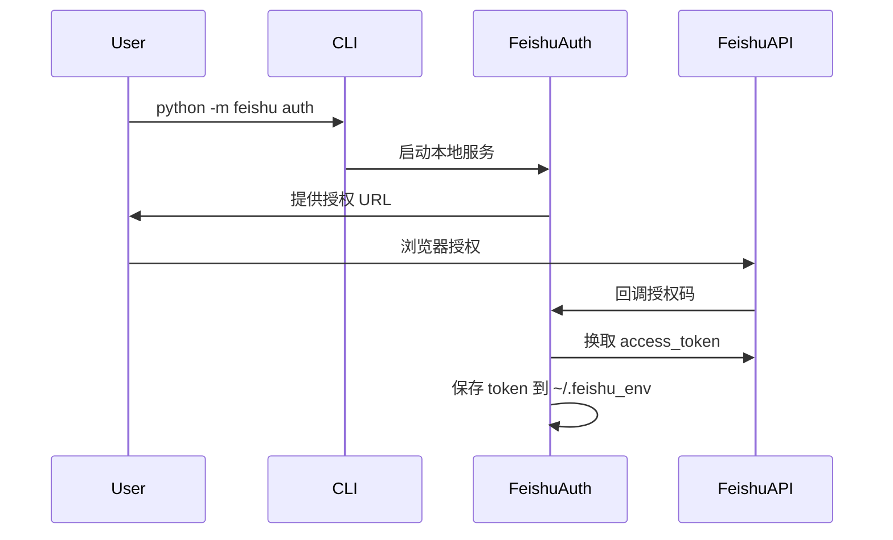

# 自动日报工具

自动采集 Claude 会话记录和飞书数据（聊天、文档、日程），通过 LLM 生成标准化日报、周报、月报。

## 一、快速开始（用户视角）

### 1.1 功能特性

- 多源数据采集：Claude 历史会话、Claude 项目会话、飞书聊天、飞书文档、飞书日程
- 智能过滤：自动分类聊天记录，过滤无效内容，标记与你相关的消息
- 报告生成：支持日报、周报、月报
- 缓存机制：已采集的数据自动缓存，避免重复请求
- 任务继承：自动继承昨日未完成任务
- 定时运行：支持 crontab 定时生成

### 1.2 安装依赖

```bash
pip install -r requirements.txt
```

### 1.3 配置说明

编辑 `config.yaml` 文件：

```yaml
# Claude 会话路径配置
claude:
  history_path: "~/.claude/history.jsonl"
  projects_path: "~/.claude/projects"

# LLM 配置
llm:
  api_key: "os.environ/ARK_API_KEY"
  base_url: "https://ark.cn-beijing.volces.com/api/v3/responses"
  model: "doubao-seed-2-0-pro-260215"
  timeout: 600

# 日报输出配置
report:
  base_dir: "reports"

# 飞书集成配置（可选）
feishu:
  enabled: true
  app_id: "os.environ/FEISHU_APP_ID"
  app_secret: "os.environ/FEISHU_APP_SECRET"
  env_dir: "~/.feishu_env"
  # ... 其他配置
```

如果启用飞书集成，需要先授权：
```bash
python -m feishu auth
```

### 1.4 使用方式

```bash
# 生成今天的日报
python daily_report.py

# 生成昨天的日报（推荐 crontab 使用）
python daily_report.py --yesterday

# 生成指定日期的日报
python daily_report.py --date 2026-03-20

# 生成日期范围的日报
python daily_report.py --start 2026-03-20 --end 2026-03-24

# 强制重新生成（覆盖已存在的）
python daily_report.py --date 2026-03-20 --force

# 生成周报
python daily_report.py --weekly 2026-W12

# 生成月报
python daily_report.py --monthly 2026-03
```

### 1.5 Crontab 定时配置

每天凌晨 2 点自动生成前一天的日报：

```bash
# 编辑 crontab
crontab -e

# 添加这一行（注意替换实际路径）
0 2 * * * cd /path/to/daily_report && python daily_report.py --yesterday
```

---

## 二、功能架构

### 2.1 数据流程图



### 2.2 飞书 OAuth 流程图



---

## 三、技术细节（开发者视角）

### 3.1 目录结构

```
daily_report/
├── daily_report.py          # 主入口
├── collector.py             # Claude 会话采集
├── generator.py             # 报告生成器
├── cache_manager.py         # 缓存管理
├── config.yaml              # 配置文件
├── requirements.txt         # 依赖
├── README.md               # 本文件
├── feishu/                 # 飞书集成模块
│   ├── __init__.py
│   ├── __main__.py        # 飞书 CLI
│   ├── auth.py            # OAuth 认证
│   ├── collector.py       # 数据采集
│   ├── filter.py          # 聊天过滤与分类
│   ├── summarizer.py      # 会话摘要
│   └── exporter.py        # 文档导出
├── inheritance/            # 任务继承模块
│   ├── __init__.py
│   └── manager.py
└── reports/               # 报告输出目录
    ├── daily/            # 日报
    ├── weekly/           # 周报
    ├── monthly/          # 月报
    ├── feishu_chat_cache/
    └── feishu_doc_cache/
```

### 3.2 核心模块说明

| 模块 | 职责 |
|------|------|
| `daily_report.py` | 主入口，协调整个流程 |
| `collector.py` | 从 ~/.claude/ 采集会话记录 |
| `generator.py` | 调用 LLM 生成报告 |
| `cache_manager.py` | 管理采集数据的缓存 |
| `feishu/auth.py` | 飞书 OAuth 认证与 token 管理 |
| `feishu/collector.py` | 采集飞书聊天、文档、日程 |
| `feishu/filter.py` | 分类聊天记录，过滤无效内容 |
| `feishu/exporter.py` | 导出飞书文档并生成摘要 |
| `inheritance/manager.py` | 管理任务继承 |

### 3.3 飞书集成配置详解

飞书集成需要：
1. 创建飞书企业自建应用
2. 配置回调地址（支持 ngrok）
3. 授权获取 access_token
4. 配置所需权限 scope

详细配置见 `docs/PROJECT_GUIDE.md`

### 3.4 调试指南

```bash
# 查看采集的数据（不生成报告）
# 数据会缓存到 cache/{date}/ 目录
ls -la cache/

# 强制刷新缓存
python daily_report.py --date 2026-03-20 --force

# 飞书 token 管理
python -m feishu auth          # 重新授权
python -m feishu token status  # 查看 token 状态
python -m feishu token refresh # 刷新 token
```

---

## 四、常见问题

**Q: 飞书 token 过期了怎么办？**
A: 运行 `python -m feishu auth` 重新授权。

**Q: 如何只更新某一天的报告？**
A: 使用 `--force` 参数：`python daily_report.py --date 2026-03-20 --force`

**Q: 可以不使用飞书集成吗？**
A: 可以，在 config.yaml 中设置 `feishu.enabled: false` 即可。
