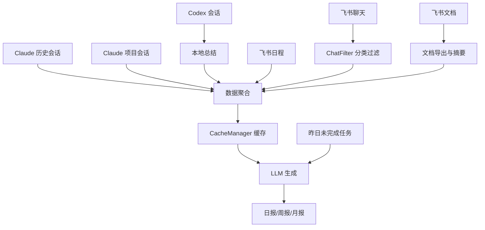
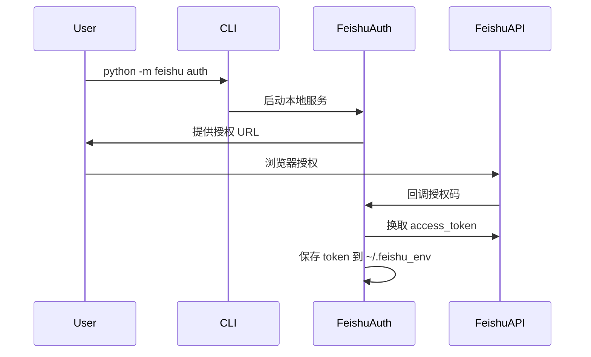

# 自动日报工具

自动采集 Claude / Codex 会话记录和飞书数据（聊天、文档、日程），通过 LLM 生成标准化日报、周报、月报。

## 一、快速开始（用户视角）

### 1.1 功能特性

- 多源数据采集：Claude 历史会话、Claude 项目会话、Codex 会话、飞书聊天、飞书文档、飞书日程
- 智能过滤：自动分类聊天记录，过滤无效内容，标记与你相关的消息
- 报告生成：支持日报、周报、月报
- 缓存机制：已采集的数据自动缓存，避免重复请求
- 任务继承：自动继承昨日未完成任务
- 定时运行：支持 crontab 定时生成

### 1.2 安装依赖

```bash
pip install -r requirements.txt
```

### 1.3 初始化

本地用户推荐先运行初始化启动器，它会生成 `config.yaml`，敏感信息仍从环境变量读取：

```bash
python daily_report.py init local
```

如果需要覆盖已有配置：

```bash
python daily_report.py --force init local
```

初始化后配置环境变量：

```bash
export ARK_API_KEY="your_ark_api_key"
export FEISHU_APP_ID="your_feishu_app_id"
export FEISHU_APP_SECRET="your_feishu_app_secret"
```

然后先运行本地环境检查：

```bash
python daily_report.py doctor
```

如果启用飞书集成，运行授权命令。`--callback` 会启动本地回调服务自动承接飞书返回的 auth code：

```bash
python -m feishu auth --callback
python -m feishu status
```

默认回调地址是 `http://localhost:8080/callback`。如果 8080 端口被占用，授权命令会自动尝试后续可用端口（如 `8081`），并在终端打印本次使用的回调地址。飞书开放平台中的应用重定向 URL 必须允许终端打印的地址，否则浏览器授权会失败。

Codex 会话默认自动采集并生成本地总结，纳入日报上下文；当天没有 Codex 会话时自动跳过。

### 1.4 三平台逐步流程

下面三组命令是同一条本地启动流程。`doctor` 会做初始化检查；`auth --callback` 会打开真实飞书授权流程；`--yesterday` 会真实请求 LLM 并生成报告。

**macOS / Linux**

```bash
python -m pip install -r requirements.txt
python daily_report.py init local

export ARK_API_KEY="your_ark_api_key"
export FEISHU_APP_ID="your_feishu_app_id"
export FEISHU_APP_SECRET="your_feishu_app_secret"

python daily_report.py doctor
python -m feishu auth --callback
python -m feishu status
python daily_report.py --yesterday
```

**Windows PowerShell**

```powershell
py -3 -m pip install -r requirements.txt
py -3 daily_report.py init local

$env:ARK_API_KEY = "your_ark_api_key"
$env:FEISHU_APP_ID = "your_feishu_app_id"
$env:FEISHU_APP_SECRET = "your_feishu_app_secret"

py -3 daily_report.py doctor
py -3 -m feishu auth --callback
py -3 -m feishu status
py -3 daily_report.py --yesterday
```

PowerShell 中 `$env:` 只对当前窗口生效；如果要长期保存，请写入系统/用户环境变量后重新打开终端。

**端口兼容**

默认 OAuth 回调监听 `http://localhost:8080/callback`。如果 8080 被占用，`doctor` 会提示备用端口，`python -m feishu auth --callback` 也会自动改用后续可用端口，并在终端打印实际回调地址。飞书开放平台的重定向 URL 必须允许终端打印的地址。

### 1.5 配置说明

也可以复制 `config.example.yaml` 为 `config.yaml` 后手动编辑：

```yaml
# Claude 会话路径配置
claude:
  history_path: "~/.claude/history.jsonl"
  projects_path: "~/.claude/projects"

# Codex 会话路径配置
codex:
  enabled: true
  sessions_path: "~/.codex/sessions"
  history_path: "~/.codex/history.jsonl"

# LLM 配置
llm:
  api_key: "os.environ/ARK_API_KEY"
  base_url: "https://ark.cn-beijing.volces.com/api/v3/responses"
  model: "deepseek-v4-flash-260425"
  timeout: 600

# 日报输出配置
report:
  base_dir: "reports"

# 飞书集成配置（可选）
feishu:
  enabled: true
  app_id: "os.environ/FEISHU_APP_ID"
  app_secret: "os.environ/FEISHU_APP_SECRET"
  env_dir: "~/.feishu_env"
  chat_cache_dir: "cache/feishu_chat_cache"
  temp_dir: "cache/feishu_docs_cache"
  llm_token_limit: 15000
  recent_docs_days: 7
  doc_summary_threshold: 10000
  redirect_uri: "os.environ/FEISHU_REDIRECT_URI"
  user_aliases:
    - "你的昵称"
    - "常用称呼"
```

`user_aliases` 用于补充“与我相关”的飞书消息匹配。程序会自动读取当前飞书授权用户姓名，并追加姓名后两位；这里仅需要写额外别名。

### 1.6 使用方式

```bash
# 生成今天的日报
python daily_report.py

# 生成昨天的日报（推荐 crontab 使用）
python daily_report.py --yesterday

# 生成指定日期的日报
python daily_report.py --date 2026-03-20

# 生成日期范围的日报
python daily_report.py --start 2026-03-20 --end 2026-03-24

# 强制重新生成（覆盖已存在的）
python daily_report.py --date 2026-03-20 --force

# 生成周报
python daily_report.py --weekly 2026-W12

# 生成月报
python daily_report.py --monthly 2026-03
```

### 1.7 Crontab 定时配置

项目提供了 `cron-wrapper.sh` 和 `crontab.txt` 用于定时任务配置：

```bash
# 查看当前 crontab
crontab -l

# 安装项目提供的 crontab 配置
crontab crontab.txt

# 编辑 crontab
crontab -e
```

**crontab.txt 包含：**
- 每小时刷新飞书 token（确保 token 永续）
- 每天凌晨 2 点生成前一天的日报

**手动配置示例：**

```bash
# 编辑 crontab
crontab -e

# Token 刷新: 每小时一次
30 * * * * /path/to/daily_report/cron-wrapper.sh python -m feishu refresh --quiet >> /tmp/daily_report_cron.log 2>&1

# 日报生成: 每天凌晨 2 点
0 2 * * * /path/to/daily_report/cron-wrapper.sh python daily_report.py --yesterday >> /tmp/daily_report_cron.log 2>&1
```

---

## 二、功能架构

### 2.1 数据流程图



### 2.2 飞书 OAuth 流程图



---

## 三、技术细节（开发者视角）

### 3.1 目录结构

```
daily_report/
├── daily_report.py          # 主入口
├── collector.py             # Claude 会话采集
├── generator.py             # 报告生成器
├── cache_manager.py         # 缓存管理
├── config.example.yaml       # 配置模板
├── config.yaml           # 配置文件（gitignore）
├── requirements.txt         # 依赖
├── README.md               # 本文件
├── cron-wrapper.sh       # Cron 包装脚本（加载环境变量）
├── crontab.txt          # Crontab 配置示例
├── feishu/                 # 飞书集成模块
│   ├── __init__.py
│   ├── __main__.py        # 飞书 CLI
│   ├── auth.py            # OAuth 认证
│   ├── collector.py       # 数据采集
│   ├── filter.py          # 聊天过滤与分类
│   ├── summarizer.py      # 会话摘要
│   └── exporter.py        # 文档导出
├── inheritance/            # 任务继承模块
│   ├── __init__.py
│   └── manager.py
├── docs/                   # 文档目录
│   ├── plans/             # 计划文档
│   ├── specs/             # 设计文档
│   └── PROJECT_GUIDE.md  # 项目指南
├── cache/                  # 缓存目录
│   ├── feishu_chat_cache/
│   └── feishu_docs_cache/
└── reports/               # 报告输出目录
    ├── daily/            # 日报（YYYY-MM/YYYY-MM-DD/ 格式）
    ├── weekly/           # 周报
    └── monthly/          # 月报
```

### 3.2 核心模块说明

| 模块 | 职责 |
|------|------|
| `daily_report.py` | 主入口，协调整个流程 |
| `collector.py` | 从 ~/.claude/ 采集会话记录 |
| `generator.py` | 调用 LLM 生成报告 |
| `cache_manager.py` | 管理采集数据的缓存 |
| `feishu/auth.py` | 飞书 OAuth 认证与 token 管理 |
| `feishu/collector.py` | 采集飞书聊天、文档、日程 |
| `feishu/filter.py` | 分类聊天记录，过滤无效内容 |
| `feishu/exporter.py` | 导出飞书文档并生成摘要 |
| `inheritance/manager.py` | 管理任务继承 |

### 3.3 飞书集成配置详解

飞书集成需要：
1. 创建飞书企业自建应用
2. 配置回调地址（默认 `http://localhost:8080/callback`；如本机 8080 被占用，可按终端提示增加备用端口回调地址）
3. 授权获取 access_token
4. 配置所需权限 scope

详细配置见 `docs/PROJECT_GUIDE.md`

### 3.4 调试指南

```bash
# 查看采集的数据（不生成报告）
# 数据会缓存到 cache/{date}/ 目录
ls -la cache/

# 强制刷新缓存
python daily_report.py --date 2026-03-20 --force

# 检查本地初始化状态
python daily_report.py doctor

# 飞书 token 管理
python -m feishu auth --callback  # 重新授权并自动承接回调
python -m feishu status        # 查看 token 状态
python -m feishu refresh       # 刷新 token
```

---

## 四、常见问题

**Q: 飞书 token 过期了怎么办？**
A: 运行 `python -m feishu auth --callback` 重新授权。

**Q: 8080 端口被占用了怎么办？**
A: `python -m feishu auth --callback` 会自动尝试后续可用端口，并打印实际使用的回调地址。需要确认飞书开放平台应用的重定向 URL 允许该地址。

**Q: 如何只更新某一天的报告？**
A: 使用 `--force` 参数：`python daily_report.py --date 2026-03-20 --force`

**Q: 可以不使用飞书集成吗？**
A: 可以，在 config.yaml 中设置 `feishu.enabled: false` 即可。

**Q: cron 任务不执行怎么办？**
A: 使用 `cron-wrapper.sh` 确保环境变量正确加载，检查日志 `/tmp/daily_report_cron.log`。
