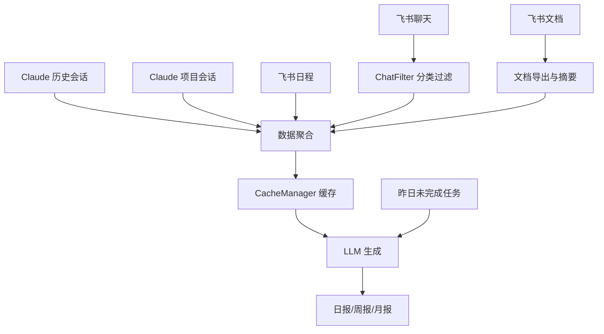
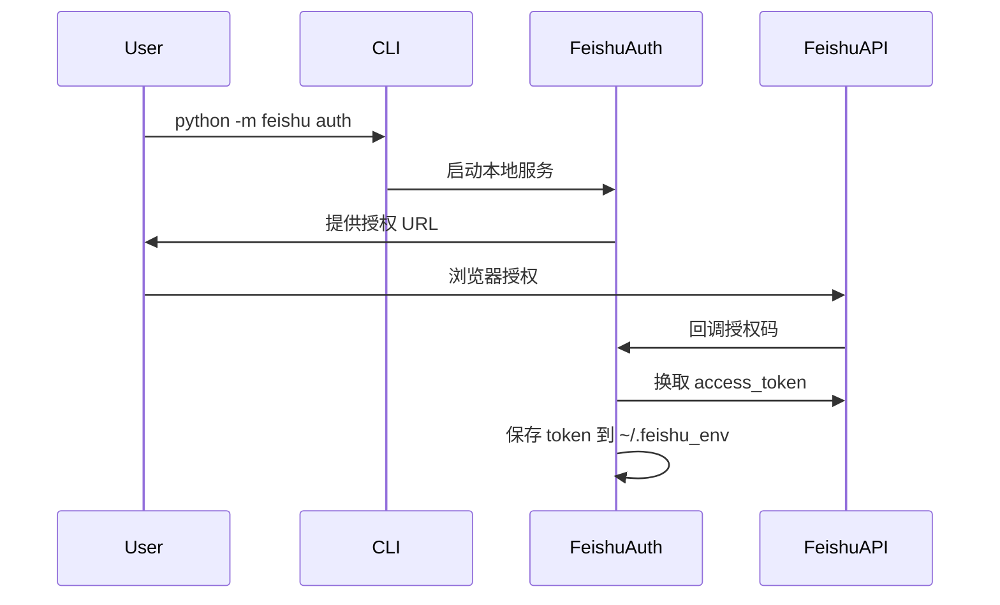

# 项目清理、报告刷新与文档完善实施计划

> **For agentic workers:** REQUIRED SUB-SKILL: Use superpowers:subagent-driven-development (recommended) or superpowers:executing-plans to implement this plan task-by-task. Steps use checkbox (`- [ ]`) syntax for tracking.

**Goal:** 清理项目无效代码、重新生成报告（除4月1日）、编写带Mermaid流程图的README

**Architecture:** 分三个阶段线性执行：1) 清理项目 2) 重新生成报告 3) 编写README

**Tech Stack:** Python, Git, Mermaid

---

## 阶段一：项目清理

### Task 1: 删除测试文件和调试脚本

**Files:**
- Delete: `test_message_fetch.py`
- Delete: `test_generator.py`
- Delete: `test_message_collection.py`
- Delete: `test_doc_export.py`
- Delete: `test_filter.py`
- Delete: `test_integration.py`
- Delete: `test_calendar.py`
- Delete: `test_marking.py`
- Delete: `debug_pipeline.py`
- Delete: `debug_calendar.py`
- Delete: `tests/` (整个目录)

**Steps:**
- [ ] **Step 1: 列出并确认要删除的文件**
```bash
cd /Users/liangjiayu/projects/daily_report
ls -la test_*.py debug_*.py
ls -la tests/
```

- [ ] **Step 2: 删除根目录测试文件**
```bash
rm -f test_message_fetch.py test_generator.py test_message_collection.py test_doc_export.py test_filter.py test_integration.py test_calendar.py test_marking.py
```

- [ ] **Step 3: 删除调试脚本**
```bash
rm -f debug_pipeline.py debug_calendar.py
```

- [ ] **Step 4: 删除 tests 目录**
```bash
rm -rf tests/
```

- [ ] **Step 5: 验证删除结果**
```bash
ls -la test_*.py debug_*.py 2>/dev/null || echo "测试和调试文件已删除"
ls -la tests/ 2>/dev/null || echo "tests 目录已删除"
```

- [ ] **Step 6: 提交更改**
```bash
git add -u
git status
```

---

### Task 2: 删除临时脚本和工作树

**Files:**
- Delete: `generate_from_input.py`
- Delete: `generate_from_file.py`
- Delete: `.worktrees/` (整个目录)

**Steps:**
- [ ] **Step 1: 删除临时脚本**
```bash
cd /Users/liangjiayu/projects/daily_report
rm -f generate_from_input.py generate_from_file.py
```

- [ ] **Step 2: 删除工作树目录**
```bash
rm -rf .worktrees/
```

- [ ] **Step 3: 验证删除结果**
```bash
ls -la generate_from_*.py 2>/dev/null || echo "临时脚本已删除"
ls -la .worktrees/ 2>/dev/null || echo ".worktrees 目录已删除"
```

- [ ] **Step 4: 提交更改**
```bash
git add -u
git status
```

---

### Task 3: 检查并清理无效 imports

**Files:**
- Check/Modify: `daily_report.py`
- Check/Modify: `collector.py`
- Check/Modify: `generator.py`
- Check/Modify: `cache_manager.py`
- Check/Modify: `feishu/__init__.py`
- Check/Modify: `feishu/auth.py`
- Check/Modify: `feishu/collector.py`
- Check/Modify: `feishu/filter.py`
- Check/Modify: `feishu/summarizer.py`
- Check/Modify: `feishu/exporter.py`
- Check/Modify: `feishu/__main__.py`
- Check/Modify: `inheritance/__init__.py`
- Check/Modify: `inheritance/manager.py`

**Steps:**
- [ ] **Step 1: 使用 flake8 检查未使用的 imports**
```bash
cd /Users/liangjiayu/projects/daily_report
python3 -m flake8 --select=F401 daily_report.py collector.py generator.py cache_manager.py feishu/*.py inheritance/*.py 2>/dev/null || echo "flake8 not available, checking manually"
```

- [ ] **Step 2: 手动检查并清理 daily_report.py**
查看文件中的 imports，移除明显未使用的

- [ ] **Step 3: 手动检查并清理 collector.py**
查看文件中的 imports，移除明显未使用的

- [ ] **Step 4: 手动检查并清理 generator.py**
查看文件中的 imports，移除明显未使用的

- [ ] **Step 5: 手动检查并清理 cache_manager.py**
查看文件中的 imports，移除明显未使用的

- [ ] **Step 6: 手动检查并清理 feishu/ 模块**
查看 feishu/*.py 文件中的 imports，移除明显未使用的

- [ ] **Step 7: 手动检查并清理 inheritance/ 模块**
查看 inheritance/*.py 文件中的 imports，移除明显未使用的

- [ ] **Step 8: 验证项目仍能正常运行**
```bash
python3 daily_report.py --help
```

- [ ] **Step 9: 提交更改（如有修改）**
```bash
git add -u
git status
```

---

## 阶段二：重新生成报告

### Task 4: 删除旧报告（除了 4月1日日报）

**Files:**
- Delete: `reports/daily/daily_report_2026-03-23.md`
- Delete: `reports/daily/daily_report_2026-03-24.md`
- Delete: `reports/daily/daily_report_2026-03-25.md`
- Delete: `reports/daily/daily_report_2026-03-26.md`
- Delete: `reports/daily/daily_report_2026-03-27.md`
- Delete: `reports/daily/daily_report_2026-03-30.md`
- Delete: `reports/daily/daily_report_2026-03-31.md`
- Delete: `reports/daily/daily_report_2026-04-02.md`
- Delete: `reports/weekly/weekly_report_2026-W13.md`
- Keep: `reports/daily/daily_report_2026-04-01.md`

**Steps:**
- [ ] **Step 1: 先备份 4月1日日报**
```bash
cd /Users/liangjiayu/projects/daily_report
cp reports/daily/daily_report_2026-04-01.md /tmp/daily_report_2026-04-01.md.bak
```

- [ ] **Step 2: 删除除 4月1日外的所有日报**
```bash
cd /Users/liangjiayu/projects/daily_report
ls reports/daily/
rm -f reports/daily/daily_report_2026-03-23.md
rm -f reports/daily/daily_report_2026-03-24.md
rm -f reports/daily/daily_report_2026-03-25.md
rm -f reports/daily/daily_report_2026-03-26.md
rm -f reports/daily/daily_report_2026-03-27.md
rm -f reports/daily/daily_report_2026-03-30.md
rm -f reports/daily/daily_report_2026-03-31.md
rm -f reports/daily/daily_report_2026-04-02.md
```

- [ ] **Step 3: 删除周报**
```bash
rm -f reports/weekly/weekly_report_2026-W13.md
```

- [ ] **Step 4: 验证 4月1日日报还在**
```bash
ls -la reports/daily/
ls -la reports/weekly/
```

- [ ] **Step 5: 恢复 4月1日日报（以防误删）**
```bash
cp /tmp/daily_report_2026-04-01.md.bak reports/daily/daily_report_2026-04-01.md
ls -la reports/daily/daily_report_2026-04-01.md
```

---

### Task 5: 重新生成日报

**Files:**
- Create: `reports/daily/daily_report_2026-03-23.md`
- Create: `reports/daily/daily_report_2026-03-24.md`
- Create: `reports/daily/daily_report_2026-03-25.md`
- Create: `reports/daily/daily_report_2026-03-26.md`
- Create: `reports/daily/daily_report_2026-03-27.md`
- Create: `reports/daily/daily_report_2026-03-30.md`
- Create: `reports/daily/daily_report_2026-03-31.md`
- Create: `reports/daily/daily_report_2026-04-02.md`

**Steps:**
- [ ] **Step 1: 生成 2026-03-23 日报**
```bash
cd /Users/liangjiayu/projects/daily_report
python daily_report.py --date 2026-03-23 --force
```

- [ ] **Step 2: 验证 2026-03-23 日报**
```bash
ls -la reports/daily/daily_report_2026-03-23.md
head -20 reports/daily/daily_report_2026-03-23.md
```

- [ ] **Step 3: 生成 2026-03-24 日报**
```bash
python daily_report.py --date 2026-03-24 --force
```

- [ ] **Step 4: 验证 2026-03-24 日报**
```bash
ls -la reports/daily/daily_report_2026-03-24.md
```

- [ ] **Step 5: 生成 2026-03-25 日报**
```bash
python daily_report.py --date 2026-03-25 --force
```

- [ ] **Step 6: 验证 2026-03-25 日报**
```bash
ls -la reports/daily/daily_report_2026-03-25.md
```

- [ ] **Step 7: 生成 2026-03-26 日报**
```bash
python daily_report.py --date 2026-03-26 --force
```

- [ ] **Step 8: 验证 2026-03-26 日报**
```bash
ls -la reports/daily/daily_report_2026-03-26.md
```

- [ ] **Step 9: 生成 2026-03-27 日报**
```bash
python daily_report.py --date 2026-03-27 --force
```

- [ ] **Step 10: 验证 2026-03-27 日报**
```bash
ls -la reports/daily/daily_report_2026-03-27.md
```

- [ ] **Step 11: 生成 2026-03-30 日报**
```bash
python daily_report.py --date 2026-03-30 --force
```

- [ ] **Step 12: 验证 2026-03-30 日报**
```bash
ls -la reports/daily/daily_report_2026-03-30.md
```

- [ ] **Step 13: 生成 2026-03-31 日报**
```bash
python daily_report.py --date 2026-03-31 --force
```

- [ ] **Step 14: 验证 2026-03-31 日报**
```bash
ls -la reports/daily/daily_report_2026-03-31.md
```

- [ ] **Step 15: 生成 2026-04-02 日报**
```bash
python daily_report.py --date 2026-04-02 --force
```

- [ ] **Step 16: 验证 2026-04-02 日报**
```bash
ls -la reports/daily/daily_report_2026-04-02.md
```

- [ ] **Step 17: 验证所有日报都已生成（除4.1保留）**
```bash
ls -la reports/daily/
```

---

### Task 6: 重新生成周报

**Files:**
- Create: `reports/weekly/weekly_report_2026-W13.md`

**Steps:**
- [ ] **Step 1: 生成 2026-W13 周报**
```bash
cd /Users/liangjiayu/projects/daily_report
python daily_report.py --weekly 2026-W13 --force
```

- [ ] **Step 2: 验证周报生成**
```bash
ls -la reports/weekly/weekly_report_2026-W13.md
head -30 reports/weekly/weekly_report_2026-W13.md
```

---

## 阶段三：编写 README.md

### Task 7: 编写新的 README.md

**Files:**
- Replace: `README.md`

**Steps:**
- [ ] **Step 1: 读取现有 README.md 作为参考**
```bash
cd /Users/liangjiayu/projects/daily_report
cat README.md
```

- [ ] **Step 2: 编写新的 README.md**
```markdown
# 自动日报工具

自动采集 Claude 会话记录和飞书数据（聊天、文档、日程），通过 LLM 生成标准化日报、周报、月报。

## 一、快速开始（用户视角）

### 1.1 功能特性

- 多源数据采集：Claude 历史会话、Claude 项目会话、飞书聊天、飞书文档、飞书日程
- 智能过滤：自动分类聊天记录，过滤无效内容，标记与你相关的消息
- 报告生成：支持日报、周报、月报
- 缓存机制：已采集的数据自动缓存，避免重复请求
- 任务继承：自动继承昨日未完成任务
- 定时运行：支持 crontab 定时生成

### 1.2 安装依赖

```bash
pip install -r requirements.txt
```

### 1.3 配置说明

编辑 `config.yaml` 文件：

```yaml
# Claude 会话路径配置
claude:
  history_path: "~/.claude/history.jsonl"
  projects_path: "~/.claude/projects"

# LLM 配置
llm:
  arkplan_settings: "~/.claude/daily_report.json"

# 日报输出配置
report:
  base_dir: "reports"

# 飞书集成配置（可选）
feishu:
  enabled: true
  app_id: "cli_a906ff60e8b99bd3"
  app_secret: "your_app_secret_here"
  env_dir: "~/.feishu_env"
  # ... 其他配置
```

如果启用飞书集成，需要先授权：
```bash
python -m feishu auth
```

### 1.4 使用方式

```bash
# 生成今天的日报
python daily_report.py

# 生成昨天的日报（推荐 crontab 使用）
python daily_report.py --yesterday

# 生成指定日期的日报
python daily_report.py --date 2026-03-20

# 生成日期范围的日报
python daily_report.py --start 2026-03-20 --end 2026-03-24

# 强制重新生成（覆盖已存在的）
python daily_report.py --date 2026-03-20 --force

# 生成周报
python daily_report.py --weekly 2026-W12

# 生成月报
python daily_report.py --monthly 2026-03
```

### 1.5 Crontab 定时配置

每天凌晨 2 点自动生成前一天的日报：

```bash
# 编辑 crontab
crontab -e

# 添加这一行（注意替换实际路径）
0 2 * * * cd /path/to/daily_report && python daily_report.py --yesterday
```

---

## 二、功能架构

### 2.1 数据流程图



### 2.2 飞书 OAuth 流程图



---

## 三、技术细节（开发者视角）

### 3.1 目录结构

```
daily_report/
├── daily_report.py          # 主入口
├── collector.py             # Claude 会话采集
├── generator.py             # 报告生成器
├── cache_manager.py         # 缓存管理
├── config.yaml              # 配置文件
├── requirements.txt         # 依赖
├── README.md               # 本文件
├── feishu/                 # 飞书集成模块
│   ├── __init__.py
│   ├── __main__.py        # 飞书 CLI
│   ├── auth.py            # OAuth 认证
│   ├── collector.py       # 数据采集
│   ├── filter.py          # 聊天过滤与分类
│   ├── summarizer.py      # 会话摘要
│   └── exporter.py        # 文档导出
├── inheritance/            # 任务继承模块
│   ├── __init__.py
│   └── manager.py
└── reports/               # 报告输出目录
    ├── daily/            # 日报
    ├── weekly/           # 周报
    ├── monthly/          # 月报
    ├── feishu_chat_cache/
    └── feishu_doc_cache/
```

### 3.2 核心模块说明

| 模块 | 职责 |
|------|------|
| `daily_report.py` | 主入口，协调整个流程 |
| `collector.py` | 从 ~/.claude/ 采集会话记录 |
| `generator.py` | 调用 LLM 生成报告 |
| `cache_manager.py` | 管理采集数据的缓存 |
| `feishu/auth.py` | 飞书 OAuth 认证与 token 管理 |
| `feishu/collector.py` | 采集飞书聊天、文档、日程 |
| `feishu/filter.py` | 分类聊天记录，过滤无效内容 |
| `feishu/exporter.py` | 导出飞书文档并生成摘要 |
| `inheritance/manager.py` | 管理任务继承 |

### 3.3 飞书集成配置详解

飞书集成需要：
1. 创建飞书企业自建应用
2. 配置回调地址（支持 ngrok）
3. 授权获取 access_token
4. 配置所需权限 scope

详细配置见 `docs/PROJECT_GUIDE.md`

### 3.4 调试指南

```bash
# 查看采集的数据（不生成报告）
# 数据会缓存到 cache/{date}/ 目录
ls -la cache/

# 强制刷新缓存
python daily_report.py --date 2026-03-20 --force

# 飞书 token 管理
python -m feishu auth          # 重新授权
python -m feishu token status  # 查看 token 状态
python -m feishu token refresh # 刷新 token
```

---

## 四、常见问题

**Q: 飞书 token 过期了怎么办？**
A: 运行 `python -m feishu auth` 重新授权。

**Q: 如何只更新某一天的报告？**
A: 使用 `--force` 参数：`python daily_report.py --date 2026-03-20 --force`

**Q: 可以不使用飞书集成吗？**
A: 可以，在 config.yaml 中设置 `feishu.enabled: false` 即可。
```
```

- [ ] **Step 3: 写入新的 README.md**
将上述内容写入 README.md

- [ ] **Step 4: 验证 README.md**
```bash
ls -la README.md
head -50 README.md
```

- [ ] **Step 5: 提交更改**
```bash
git add README.md
git status
```

---

### Task 8: 最终提交与验证

**Files:**
- All modified files

**Steps:**
- [ ] **Step 1: 查看 git 状态**
```bash
cd /Users/liangjiayu/projects/daily_report
git status
```

- [ ] **Step 2: 提交所有更改**
```bash
git add -u
git add README.md
git commit -m "feat: 项目清理、报告刷新与文档完善

- 清理测试文件、调试脚本、临时脚本
- 重新生成日报（除4月1日）和周报
- 重写 README.md，添加 Mermaid 流程图

Generated with [Claude Code](https://claude.ai/code)
via [Happy](https://happy.engineering)

Co-Authored-By: Claude <noreply@anthropic.com>
Co-Authored-By: Happy <yesreply@happy.engineering>
"
```

- [ ] **Step 3: 验证最终状态**
```bash
git log -1 --stat
ls -la
```

---

## 验收清单

- [ ] 所有测试文件已删除
- [ ] tests/ 目录已删除
- [ ] 调试脚本已删除
- [ ] 临时脚本已删除
- [ ] .worktrees/ 已删除
- [ ] 2026-04-01 日报保留
- [ ] 其他 8 个日报重新生成成功
- [ ] 2026-W13 周报重新生成成功
- [ ] README.md 包含 Mermaid 流程图
- [ ] 所有更改已提交
