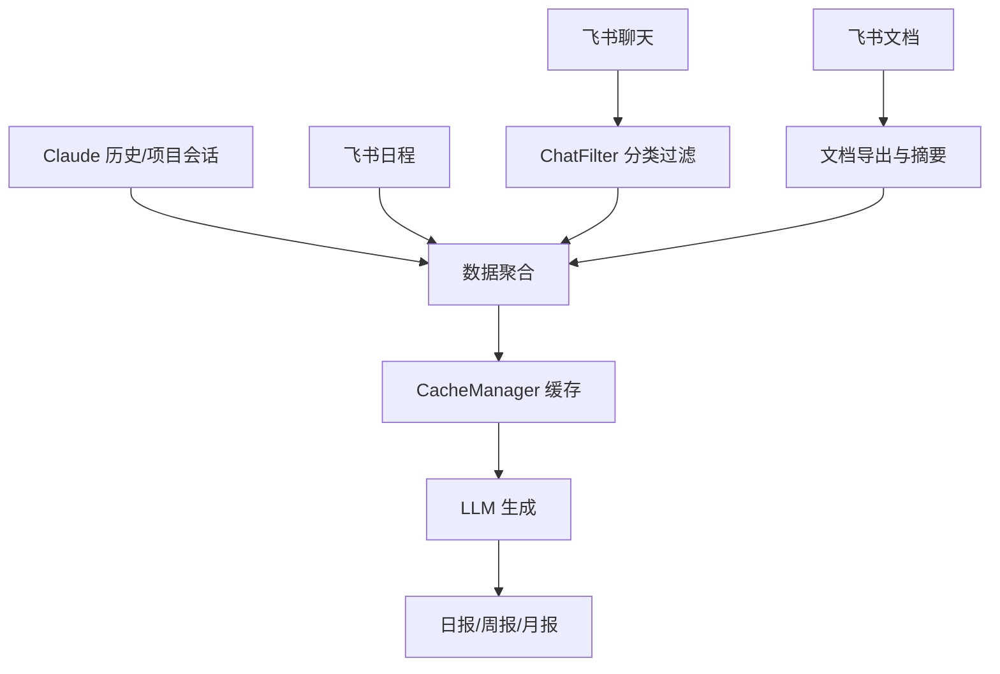
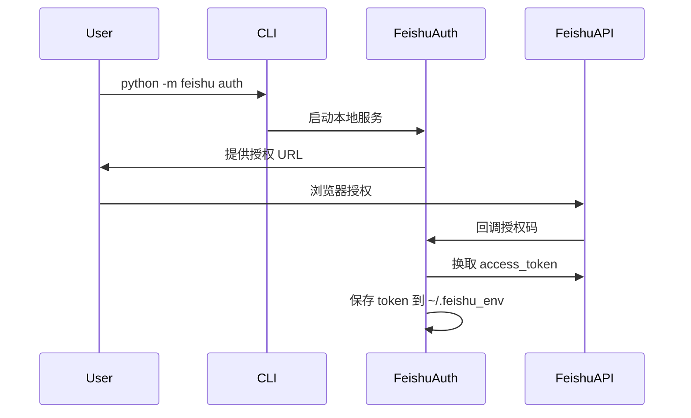

# 项目清理、报告刷新与文档完善设计

日期：2026-04-02

## 一、背景与目标

### 1.1 背景
当前 daily_report 项目存在以下需要优化的问题：
- 根目录下散落多个 test_*.py 测试文件，同时 tests/ 目录也存在测试文件，结构冗余
- 部分临时脚本文件需要清理
- 报告文件需要刷新（除 4月1日日报）
- 缺少完整的带架构流程图的 README 文档

### 1.2 目标
- 清理项目架构，移除无效代码和测试文件
- 重新生成日报和周报（保留 2026-04-01 日报）
- 编写完整的 README.md，包含 Mermaid 架构流程图

---

## 二、清理范围与策略

### 2.1 文件清理清单

| 类别 | 路径/模式 | 操作 |
|------|-----------|------|
| 根目录测试文件 | test_*.py（共9个） | 删除 |
| 测试目录 | tests/ | 删除整个目录 |
| 调试脚本 | debug_*.py | 删除 |
| 临时脚本 | generate_from_input.py<br>generate_from_file.py | 删除 |
| 工作树目录 | .worktrees/ | 删除 |

### 2.2 代码清理清单

检查并清理以下主文件中的无效 imports：
- `daily_report.py`
- `collector.py`
- `generator.py`
- `cache_manager.py`
- `feishu/*.py` 模块下的所有文件

清理策略：
- 仅移除明显未使用的 import
- 保持功能完整性优先

---

## 三、报告重新生成策略

### 3.1 保留与删除清单

| 目录 | 文件名 | 操作 |
|------|--------|------|
| reports/daily/ | daily_report_2026-04-01.md | **保留** |
| reports/daily/ | 其他 8 个日报文件 | 删除并重新生成 |
| reports/weekly/ | weekly_report_2026-W13.md | 删除并重新生成 |
| reports/feishu_doc_cache/ | 所有缓存文件 | **保留**（避免重复导出） |

### 3.2 重新生成的日期范围

**日报：**
- 2026-03-23
- 2026-03-24
- 2026-03-25
- 2026-03-26
- 2026-03-27
- 2026-03-30
- 2026-03-31
- 2026-04-02

**周报：**
- 2026-W13

### 3.3 生成命令

```bash
# 逐个日期生成（使用缓存，避免重复采集）
python daily_report.py --date 2026-03-23 --force
python daily_report.py --date 2026-03-24 --force
python daily_report.py --date 2026-03-25 --force
python daily_report.py --date 2026-03-26 --force
python daily_report.py --date 2026-03-27 --force
python daily_report.py --date 2026-03-30 --force
python daily_report.py --date 2026-03-31 --force
python daily_report.py --date 2026-04-02 --force

# 生成周报
python daily_report.py --weekly 2026-W13 --force
```

---

## 四、README.md 文档结构设计

### 4.1 文档大纲

```
# 自动日报工具

## 一、快速开始（用户视角）
### 1.1 功能特性
### 1.2 安装依赖
### 1.3 配置说明
### 1.4 使用方式
### 1.5 Crontab 定时配置

## 二、功能架构
### 2.1 数据流程图（Mermaid）
### 2.2 飞书 OAuth 流程图（Mermaid）

## 三、技术细节（开发者视角）
### 3.1 目录结构
### 3.2 核心模块说明
### 3.3 飞书集成配置详解
### 3.4 调试指南

## 四、常见问题
```

### 4.2 Mermaid 流程图设计

**主数据流程图：**


**飞书 OAuth 流程图：**


---

## 五、验收标准

### 5.1 清理验收
- [ ] 根目录无 test_*.py 文件
- [ ] tests/ 目录已删除
- [ ] debug_*.py 已删除
- [ ] 临时脚本已删除
- [ ] .worktrees/ 已删除
- [ ] 主模块无无效 import

### 5.2 报告验收
- [ ] 2026-04-01 日报完好无损
- [ ] 其他 8 个日报重新生成成功
- [ ] 2026-W13 周报重新生成成功
- [ ] 所有报告内容完整、格式正确

### 5.3 文档验收
- [ ] README.md 存在且结构完整
- [ ] 包含 Mermaid 流程图且渲染正常
- [ ] 快速开始部分清晰可操作
- [ ] 技术细节部分覆盖核心模块
